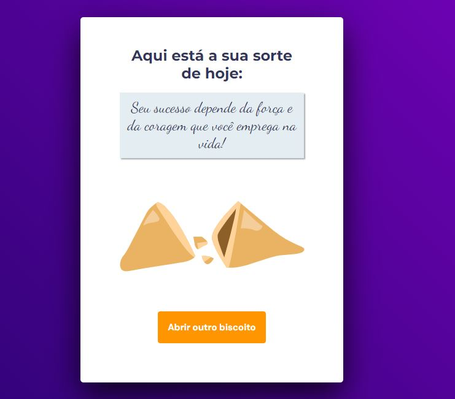
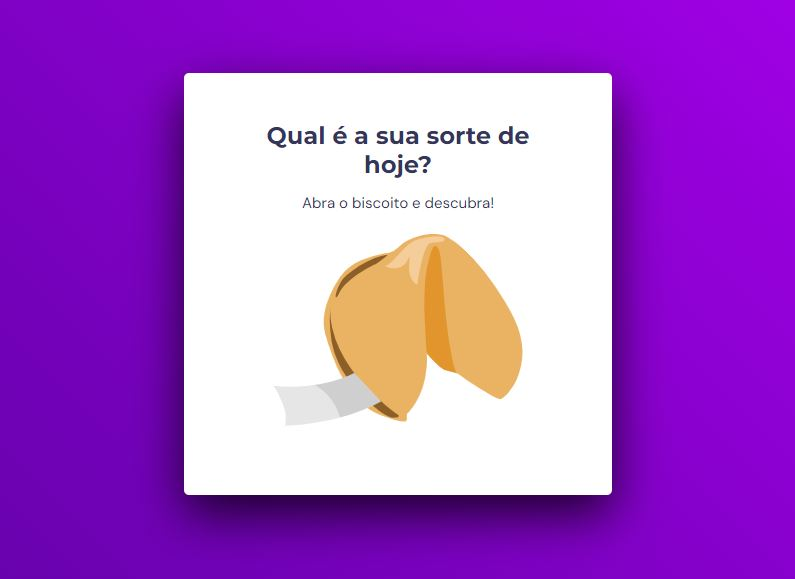

# <h1 align="center"> Biscoito da sorte </h1>

Aplicação feita com html, css e javascript para desenvolver a lógica, a manipulação da DOM, a utilização de funções callback  

  <a href="#-tecnologias">Tecnologias</a>&nbsp;&nbsp;&nbsp;|&nbsp;&nbsp;&nbsp;
  <a href="#-projeto">Projeto</a>&nbsp;&nbsp;&nbsp;|&nbsp;&nbsp;&nbsp;
  <a href="#-layout">Layout</a>&nbsp;&nbsp;&nbsp;|&nbsp;&nbsp;&nbsp;
  <a href="#memo-licença">Licença</a>

  

 

  

 Clicou no biscoito para receber a mensagem da sorte, muda para tela abaixo: 

  

  <video width="470" height="300"  controls="controls" autoplay="autoplay">
      <source src="./videos/bsorte.mp4" type="video/mp4" />
    </video>

## 🚀 Tecnologias

Esse projeto foi desenvolvido com as seguintes tecnologias:

- HTML e CSS
- JavaScript
- Git e Github
- Figma

## 💻 Projeto

É uma aplicação web onde modelamos o layout com html e css e as funcionalidades em Javascript (como clicar no biscoito da sorte, munda de tela, e aparecer a sorte do dia, clicando no botão volta para tela inicial.), desafio foi ótimo para praticar a manipulação da DOM com js, para estilização com html e css.

## 🔖 Layout

Você pode visualizar o layout do projeto através [DESSE LINK](<https://www.figma.com/file/8rjYkoTgXyvsN02EIHR9qe/Jogo-Adivinha%C3%A7%C3%A3o-(Copy)?node-id=5%3A114&mode=dev>). É necessário ter conta no [Figma](https://figma.com) para acessá-lo.

## :memo: Licença

Esse projeto está sob a licença MIT.

---

Feito com ♥ by Rocketseat [Jair Torezone](https://www.linkedin.com/in/jair-torezone/) :wave:
