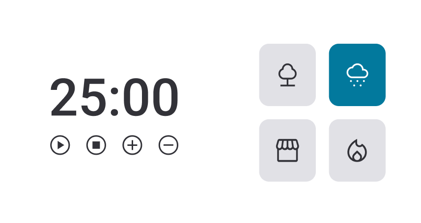

# <h1 align="center"> Pomodoro - FocusTime </h1>

Aplicação feita com html, css e javascript para desenvolver a lógica, a manipulação da DOM, a utilização de funções callback  

  <a href="#-tecnologias">Tecnologias</a>&nbsp;&nbsp;&nbsp;|&nbsp;&nbsp;&nbsp;
  <a href="#-projeto">Projeto</a>&nbsp;&nbsp;&nbsp;|&nbsp;&nbsp;&nbsp;
  <a href="#-layout">Layout</a>&nbsp;&nbsp;&nbsp;|&nbsp;&nbsp;&nbsp;
  <a href="#memo-licença">Licença</a>

  

 

  

 Pomodo onde pode adicionar tempo em 5 em 5 minutos ou diminur 

## 🚀 Tecnologias

Esse projeto foi desenvolvido com as seguintes tecnologias:

- HTML e CSS
- JavaScript
- Git e Github
- Figma
- Responsivoo

## 💻 Projeto

É uma aplicação web onde modelamos o layout com html e css e as funcionalidades em Javascript (Podemos adicionar ou diminuir tempo em 5 em 5 minutos, cada card corresponde a um abiente a musica de fundo, tem a funcionalidade dar e light mode,), desafio foi ótimo para praticar a manipulação da DOM com js, para estilização com html e css.

## 🔖 Layout

Você pode visualizar o layout do projeto através [DESSE LINK](<https://www.figma.com/file/eJTyTndZFcgAxH1sahWut9/Stage-05---Focus-Timer-2.0-(Copy)?node-id=0%3A1&mode=dev>). É necessário ter conta no [Figma](https://figma.com) para acessá-lo.

## :memo: Licença

Esse projeto está sob a licença MIT.

---

Feito com ♥ by Rocketseat [Jair Torezone](https://www.linkedin.com/in/jair-torezone/) :wave:
