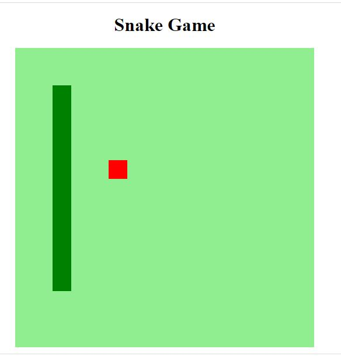

# #Projetos Js

    Coletânia - Alguns projetos feito com HTML, CSS, Javascript, Bootstrapt  
    <a href="#">Acesse aos projetos abaixo</a> 
     <table>
    <thead>
        <tr>
            <th align="center">
                 
                

                    <small></small>
                

            </th>
            <th align="center">
                 
                
 
                    <small>
                        MÓDULO
                    </small>
                

            </th>
            <th align="left">
                
                
 
                    <small>
                    CALENDÁRIO
                    </small>
                

            </th>
            <th align="center">
                
                
 
                    <small>
                    PREVIEW
                    </small>
                

            </th>
        </tr>
    </thead>
    <tbody>
        <tr>
            <td>01</td>
            <td><a href="https://github.com/JairTorezone/coletanea-projetos-js/tree/main/JOGO-COBRINHA"> Snakes </a></td>
            <td>13/03/2019 à 05/04/2019</td>
            <td align="center">
            </td>
        </tr>
    
        
      
    </tbody>
</table>

